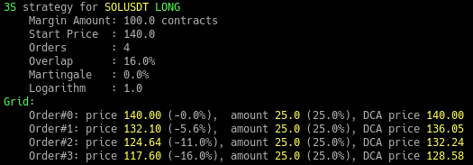
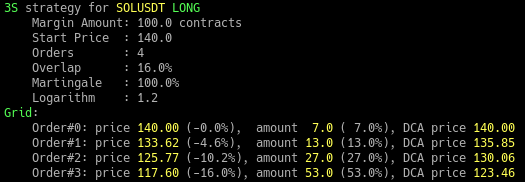

# 3S_order_grid
**Build Limit Order Grid for 3S Crypto Trading Strategy. Print results. **
Thanks to Youtube chanel NN "Не Наблюдатель"! 
About 3S Strategy see: https://www.youtube.com/watch?v=tODWA2E27uE

For your Order Grid you can set start price, direction SHORT or LONG, price spread in %, number
of orders and total margin for position. 
Also you can set Martingale in % and logarithmic orders offset coefficient. 
You can just print it in console or use this code as a module to get order grid as a dictionary
then you can use it to set limit orders at real Crypto Exchange. 
Have a good profit!

https://github.com/sergeymusenko/3S_order_grid

**Results printout examples: **
 
 

